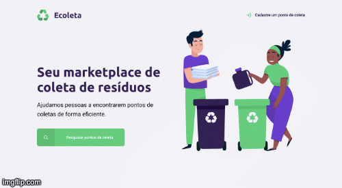

<h1 align="center">
  
</h1>

<h1 align="center">
  
</h1>

# Index
- [Index](#index)
  - [📝 About](#-about)
  - [💻 Technologies](#-technologies)
  - [Instructions to use it](#instructions-to-use-it)

## 📝 About
**Ecoleta it's a system about recycle ♻️, where you can create and save recycling collection points.

---

## 💻 Technologies

This project uses technologies likes: 

- [Html](https://developer.mozilla.org/en-US/docs/Web/HTML)
- [Css](https://developer.mozilla.org/en-US/docs/Web/CSS)
- [Javascript](https://developer.mozilla.org/en-US/docs/Web/JavaScript)
- [NodeJs](https://nodejs.org/en/)
- [Express](https://expressjs.com/)
- [Nunjucks](https://mozilla.github.io/nunjucks/)
- [Sqlite3](https://www.sqlite.org/index.html)

---

## Instructions to use it

```bash

  # Clone repo
  $ git clone https://github.com/bonejah/ecoleta

  # Enter folder ecoleta
  $ cd ecoleta

  # Download dependecies project
  $ npm ynstall

  # Run project port 3000
  $ npm start 

  # Open browser: http://localhost/3000

```
---
Developed by Bruno Lima June/2020 🦧

